# 🗺️ Cartographer

[](https://github.com/Meridian-Inc/cartographer/actions/workflows/tests.yml)
[](https://github.com/Meridian-Inc/cartographer/actions/workflows/lint.yml)
[](https://github.com/Meridian-Inc/cartographer/actions/workflows/load-tests.yml)
[](https://github.com/Meridian-Inc/cartographer/actions/workflows/load-tests.yml)
[](https://codecov.io/gh/Meridian-Inc/cartographer)

[](https://cartographer.artzima.dev/embed/8gsm2mmYhfwvKhnGYTvJ6Spd)

> 🖱️ **[Click the image to view the interactive map](https://cartographer.artzima.dev/embed/8gsm2mmYhfwvKhnGYTvJ6Spd)**

**See every device on your network at a glance.**

Cartographer is a self-hosted app that maps out your home or office network. It finds all the devices, shows how they're connected, and keeps an eye on their health — so you always know what's online and what's not.

## Architecture

```mermaid
flowchart TB
    subgraph Client["🖥️ Client"]
        Browser["Browser<br/><b>Vue.js 3</b> + <b>TypeScript</b><br/>Vite • Pinia • D3.js"]
    end

    subgraph Gateway["🚪 API Gateway"]
        Backend["Backend Service<br/><i>:8000</i><br/><b>FastAPI</b> + <b>Python</b><br/>SQLAlchemy • HTTPX • WebSocket"]
    end

    subgraph Services["⚙️ Microservices"]
        Health["Health Service<br/><i>:8001</i><br/><b>FastAPI</b><br/>ICMP • DNS • Speedtest"]
        Auth["Auth Service<br/><i>:8002</i><br/><b>FastAPI</b><br/>JWT • bcrypt • SQLAlchemy"]
        Metrics["Metrics Service<br/><i>:8003</i><br/><b>FastAPI</b><br/>Redis Pub/Sub"]
        Assistant["Assistant Service<br/><i>:8004</i><br/><b>FastAPI</b><br/>LangChain • Streaming"]
        Notification["Notification Service<br/><i>:8005</i><br/><b>FastAPI</b><br/>SQLAlchemy • Anomaly Detection"]
    end

    subgraph Storage["💾 Data Storage"]
        Postgres[("PostgreSQL<br/><i>:5432</i><br/><b>Primary Database</b><br/>users • networks • notifications")]
        Redis[("Redis<br/><i>:6379</i><br/><b>Pub/Sub & Cache</b>")]
    end

    subgraph External["🌐 External Services"]
        LAN["LAN Devices<br/><b>ARP</b> • <b>ICMP</b>"]
        AI["AI Providers<br/><b>OpenAI</b> • <b>Anthropic</b><br/><b>Google Gemini</b> • <b>Ollama</b>"]
        Email["<b>Resend</b><br/>Email API"]
        Discord["<b>Discord</b><br/>Bot API"]
    end

    %% Client connections
    Browser <-->|"HTTP/WS"| Backend

    %% Backend proxy routes
    Backend -->|"/api/health/*"| Health
    Backend -->|"/api/auth/*"| Auth
    Backend -->|"/api/metrics/*"| Metrics
    Backend -->|"/api/assistant/*"| Assistant
    Backend -->|"/api/notifications/*"| Notification

    %% Service to storage
    Backend --> Postgres
    Auth --> Postgres
    Notification --> Postgres

    %% Redis pub/sub
    Metrics -->|"Publish"| Redis
    Redis -->|"Subscribe"| Browser

    %% Service to service
    Metrics -->|"Fetch Health"| Health
    Metrics -->|"Fetch Layout"| Backend
    Assistant -->|"Get Context"| Metrics
    Health -->|"Report Events"| Notification
    Notification -->|"Get Baselines"| Health

    %% External connections
    Health -->|"ICMP Ping"| LAN
    Backend -->|"ARP Scan"| LAN
    Assistant --> AI
    Notification --> Email
    Notification --> Discord

    %% Styling
    classDef gateway fill:#4f46e5,stroke:#312e81,color:#fff
    classDef service fill:#0891b2,stroke:#164e63,color:#fff
    classDef storage fill:#059669,stroke:#064e3b,color:#fff
    classDef external fill:#d97706,stroke:#78350f,color:#fff
    classDef client fill:#7c3aed,stroke:#4c1d95,color:#fff

    class Backend gateway
    class Health,Auth,Metrics,Assistant,Notification service
    class Postgres,Redis storage
    class LAN,AI,Email,Discord external
    class Browser client
```



**Service Ports:**
| Service | Port | Purpose |
|---------|------|---------|
| Backend | 8000 | API Gateway + Static Files |
| Health | 8001 | Device health monitoring |
| Auth | 8002 | User authentication (JWT) |
| Metrics | 8003 | Real-time topology metrics |
| Assistant | 8004 | AI-powered network assistant |
| Notification | 8005 | Alerts via Email/Discord |
| PostgreSQL | 5432 | Primary database (users, networks, notifications) |
| Redis | 6379 | Pub/Sub event streaming |

## What it does

- **Discovers your network** — Hit "Run Mapper" and watch as devices appear: routers, servers, NAS boxes, phones, smart home gadgets, you name it.
- **Drag-and-drop editing** — Rearrange the map to match how your network actually looks. Label things, group them, make it yours.
- **Health at a glance** — Green rings mean online. Red means trouble. No more guessing if your printer is down again.
- **Smart alerts** — Get notified when something goes wrong. Cartographer learns your network's normal patterns and alerts you to unusual behavior — like a device going offline unexpectedly or sudden latency spikes.
- **AI assistant** — Ask questions about your network in plain English. "What's down?" "Why is my connection slow?" Get instant answers.
- **Live updates** — See network changes in real-time as devices come online or go offline.
- **Saves your work** — Your layout is saved automatically, so you don't lose your changes.
- **Multi-user** — Set up accounts for family or teammates with different access levels.

## Getting started

If you're self-hosting, a Linux box or Docker is the smoothest path. Docker on Linux can use host networking, which gives the mapper and health checks the best LAN visibility.

**Docker (recommended for all platforms)**

Linux (best LAN visibility):
1. `./deploy.sh up`
2. Or `docker compose up --build -d`

macOS and Windows (Docker Desktop):
1. `docker compose -f docker-compose.windows.yml up --build -d`

Note: Docker Desktop does not support host networking, so LAN discovery and ICMP health checks can be limited. For the most reliable results, run Cartographer on a Linux box or a Linux VM/host.

Then open **http://localhost:8000** in your browser.

The first time you visit, you'll create an owner account. After that, click **Run Mapper** to scan your network and start building your map!

**Native (no Docker)**

Linux/macOS:
1. `./dev.sh setup`
2. `./dev.sh start`

Windows (supported, but Docker Desktop is recommended for self-hosting):
1. `.\dev.ps1 setup`
2. `.\dev.ps1 start`

## AI Assistant

The assistant can answer questions about your network using natural language:

- *"What devices are unhealthy?"*
- *"Show me devices with high latency"*
- *"Which devices have been offline today?"*
- *"Summarize my network health"*

To enable the assistant, you'll need to configure at least one AI provider. Copy `.example.env` to `.env` and add your API key:

```bash
cp .example.env .env
# Edit .env and add your API key (OpenAI, Anthropic, Google, or use Ollama for free local models)
```

If you run [Ollama](https://ollama.ai) locally, no API key is needed — just make sure it's running!

## Notifications

Cartographer can alert you when things go wrong on your network:


- **Device down** — Know immediately when a server, router, or important device stops responding.
- **Device recovered** — Get a heads-up when things come back online.
- **Unusual behavior** — Cartographer learns what's normal for your network and flags anything strange — like unexpected outages or performance issues.

### Notification channels

You can receive alerts via:

- **Email** — Get clean, easy-to-read emails when something needs your attention.
- **Discord** — Send alerts to a Discord channel or get direct messages from the Cartographer bot.

### Setting up email notifications

To receive email alerts, sign up for a free [Resend](https://resend.com) account and add your API key to `.env`:

```bash
RESEND_API_KEY=your_key_here
```

### Setting up Discord notifications

1. **Create a Discord app** — Go to the [Discord Developer Portal](https://discord.com/developers/applications) and click "New Application". Give it a name like "Cartographer".

2. **Create a bot** — In your app's settings, go to the "Bot" section and click "Add Bot". Copy the bot token.

3. **Add your credentials to `.env`**:
   ```bash
   DISCORD_BOT_TOKEN=your_bot_token
   DISCORD_CLIENT_ID=your_client_id  # Found in the "General Information" section
   ```

4. **Invite the bot to your server** — Once Cartographer is running, go to the notification settings in the app. You'll find an invite link to add the bot to your Discord server.

5. **Pick a channel** — In the app's notification preferences, select which Discord server and channel should receive alerts (or enable DMs to get alerts privately).

### Customizing your alerts

In the app, you can configure:
- Which types of alerts you want (device offline, anomalies, etc.)
- Quiet hours so you're not woken up at 3am
- Rate limits to prevent notification spam
- Minimum priority threshold

## Configuration

All settings are optional and have sensible defaults. To customize, copy the example file:

```bash
cp .example.env .env
```

Then edit `.env` with your settings. See `.example.env` for all available options and descriptions.

## Tips

- **Pan mode** lets you scroll and zoom around the map.
- **Edit mode** lets you drag nodes, change their type, and rewire connections.
- Click any device to see more details and health info.
- Your changes auto-save, but you can also use **Save Map** to be sure.
- Open the **Assistant** panel and ask questions about your network in plain English.
- Set up **Notifications** to stay informed — the more Cartographer monitors your network, the smarter its alerts get.

## Load Testing

Cartographer includes a comprehensive load testing suite built with [Locust](https://locust.io/), a modern Python-based load testing framework. Use it to verify performance, find bottlenecks, and ensure stability under heavy usage.

**Nightly Capacity Tests:** Automated load tests run every night at 2 AM UTC to discover the system's maximum sustainable capacity. The "Nightly Capacity" badge above shows the number of concurrent users the system handled successfully in the most recent nightly run.

### Quick Start

```bash
# Install dependencies
cd load-tests
pip install -r requirements.txt

# Run a quick test on all services
python run_load_tests.py -s all -u 10 -r 2 -t 60 --username YOUR_USERNAME --password YOUR_PASSWORD

# Or open the interactive web UI
python run_load_tests.py -s all --web --username YOUR_USERNAME --password YOUR_PASSWORD
```

### Technology

| Component | Technology | Purpose |
|-----------|------------|---------|
| Framework | [Locust](https://locust.io/) | Distributed load testing with Python |
| HTTP Client | [HTTPX](https://www.python-httpx.org/) | Async HTTP requests |
| Test Data | [Faker](https://faker.readthedocs.io/) | Generate realistic test data |

### Available Test Targets

| Service | Port | Description |
|---------|------|-------------|
| `all` | 8000 | All services via the backend proxy |
| `health` | 8001 | Device monitoring, ping, DNS |
| `auth` | 8002 | Authentication and user management |
| `metrics` | 8003 | Network snapshots, Redis pub/sub |
| `assistant` | 8004 | AI chat, providers, context |
| `notifications` | 8005 | Alerts, Discord, anomaly detection |

### Common Test Scenarios

```bash
# Baseline test (10 users, 60 seconds)
python run_load_tests.py -s all -u 10 -r 2 -t 60

# Sustained load test with HTML report
python run_load_tests.py -s all -u 50 -r 5 -t 600 --html report.html

# Spike test (high load, short duration)
python run_load_tests.py -s all -u 200 -r 50 -t 120

# Read-only operations (dashboard simulation)
python run_load_tests.py -s all -u 100 -r 10 -t 300 --tags read

# Stress test a single service
python run_load_tests.py -s metrics -u 100 -r 20 -t 300
```

### Target Metrics

| Metric | Good | Acceptable | Poor |
|--------|------|------------|------|
| p50 Response | < 100ms | < 500ms | > 1s |
| p95 Response | < 500ms | < 2s | > 5s |
| Failure Rate | < 0.1% | < 1% | > 5% |

See `load-tests/README.md` for advanced usage, distributed testing, CI/CD integration, and test customization.

## Tests

Cartographer maintains comprehensive test coverage across all services, validated by CI on every push and pull request.

### Running Tests Locally

**Backend services (Python):**
```bash
# Backend gateway
cd backend && pip install -r requirements.txt
pytest tests/ --cov=app --cov-report=term-missing

# Individual microservices
cd assistant-service && pytest tests/ --cov=app
cd auth-service && pytest tests/ --cov=app
cd health-service && pytest tests/ --cov=app
cd metrics-service && pytest tests/ --cov=app
cd notification-service && pytest tests/ --cov=app
```

**Frontend (TypeScript/Vue):**
```bash
cd frontend && npm ci
npm run test           # Run tests once
npm run test:coverage  # Run with coverage report
```

### Linting

Cartographer enforces consistent code style using **Black** + **Flake8** + **isort** for Python and **ESLint** + **Prettier** for TypeScript/Vue.

**Run linters:**
```bash
# All services
npm run lint              # Check all services
npm run format            # Auto-fix all services

# Backend only
npm run lint:backend      # Check all backend services
npm run format:backend    # Auto-fix all backend services

# Frontend only
npm run lint:frontend     # Check frontend
npm run format:frontend   # Auto-fix frontend

# Individual backend services
npm run lint:backend:main          # Backend gateway
npm run lint:backend:assistant     # Assistant service
npm run lint:backend:auth          # Auth service
npm run lint:backend:health        # Health service
npm run lint:backend:metrics       # Metrics service
npm run lint:backend:notifications # Notification service
```

**Individual service commands:**
```bash
# Python services (backend, assistant-service, auth-service, etc.)
cd backend
black app/ tests/           # Format code
isort app/ tests/           # Sort imports
flake8 app/ tests/          # Check style

# Frontend
cd frontend
npm run lint                # Check TypeScript/Vue
npm run lint:fix            # Auto-fix
npm run format              # Format with Prettier
npm run format:check        # Check formatting
```

### Coverage Requirements

| Service | Minimum Coverage |
|---------|-----------------|
| Backend | 90% |
| Frontend | — |
| Assistant Service | 95% |
| Auth Service | 95% |
| Health Service | 95% |
| Metrics Service | 95% |
| Notification Service | 80% |

### CI

All services run linting, tests, and coverage checks in parallel on every push/PR to `main`:
- **[Lint workflow](https://github.com/Meridian-Inc/cartographer/actions/workflows/lint.yml)** - Code style enforcement
- **[Tests workflow](https://github.com/Meridian-Inc/cartographer/actions/workflows/tests.yml)** - Test suite execution

Coverage reports are uploaded to [Codecov](https://codecov.io/gh/Meridian-Inc/cartographer).

## Contributing

### Commit conventions

This project uses [Conventional Commits](https://www.conventionalcommits.org/) for semantic versioning. All commits must follow this format:

```
<type>(<scope>): <description>

[optional body]

[optional footer]
```

**Commit types:**

| Type | Description | Version Bump |
|------|-------------|--------------|
| `feat` | New feature | Minor (0.x.0) |
| `fix` | Bug fix | Patch (0.0.x) |
| `perf` | Performance improvement | Patch |
| `docs` | Documentation only | None |
| `style` | Code style (formatting, semicolons) | None |
| `refactor` | Code refactoring | None |
| `test` | Adding or updating tests | None |
| `chore` | Maintenance tasks | None |
| `ci` | CI/CD changes | None |
| `build` | Build system changes | None |
| `lint` | Linting fixes | None |
| `config` | Configuration changes | None |

**Examples:**
```bash
feat(auth): add OAuth2 support
fix(network): resolve connection timeout issue
docs: update README with deployment instructions
refactor(backend): simplify database queries
```

**Breaking changes** trigger a major version bump. Add `!` after the type or include `BREAKING CHANGE:` in the footer:
```bash
feat!: redesign API endpoints
```

### Setup for development

```bash
# Install development dependencies (commit validation)
npm install

# The prepare script automatically sets up git hooks
```

### Automatic releases

Commits on the `main` branch automatically trigger a release:
1. Version is bumped based on commit type (`feat` → minor, `fix` → patch)
2. `CHANGELOG.md` is updated
3. A git tag is created

After committing, push the release:
```bash
git push --follow-tags origin main
# Or use the helper script:
npm run push:release
```

**Skip auto-release for a commit:**
```bash
SKIP_AUTO_RELEASE=1 git commit -m "chore: quick fix"
# Or use the npm script:
npm run commit:no-release
```

### Manual releases

```bash
# Preview what the next release would look like
npm run release:dry-run

# Create a release (bumps version, updates changelog, creates tag)
npm run release

# Or specify the version bump type
npm run release:patch  # 0.0.x
npm run release:minor  # 0.x.0
npm run release:major  # x.0.0
```

## Need help?

- Make sure Docker is running and you're on the same network you want to map.
- The app needs elevated network permissions to scan devices — Docker Compose handles this automatically.
- **Assistant not responding?** Make sure at least one AI provider is configured in your `.env` file.
- **Not receiving notifications?** Check that your email or Discord credentials are set up correctly in `.env`, and make sure notifications are enabled in your preferences.
- For advanced setup (production deployments, custom ports, etc.), check out `deploy.sh --help`.

---

Built with FastAPI, Vue, and a lot of ping packets. 🗺️
